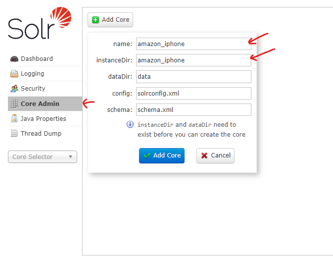
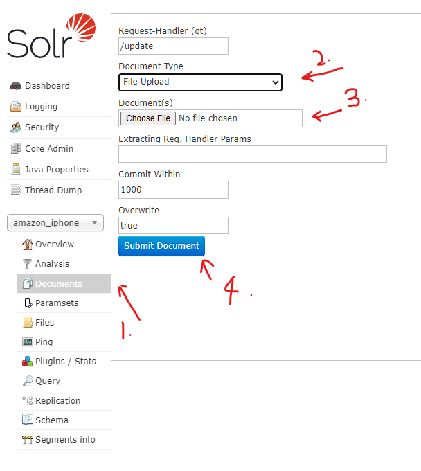

# Information Retrieval Group 16

This Project will be focused on the reviews of the Apple IPhone models from the Amazon Store.

## Modules:
### Crawler
The Crawler Module helps us to crawl the data using our API keys to gather data from the Amazon Store on the Reviews of the IPhone Models. In cases of any new data, this will allow us to update the indexer, with the new incremental indexing shown.

### Search
The Search Module presents the user with five queries, the user can choose either of the five queries to be searched. The results and speed of the query will be displayed.


## Setting up of Environment
Create a Conda Environment, make sure you're using the correct environment

```bash
conda create -n env-name
conda activate env-name
```

Install all the following packages using the command below:

```bash
pip install -r requirements.txt
```

### Flask
To run the flask, head to app.py and run the python file to get the server up.

### Streamlit UI
To run the streamlit UI, open up terminal and run the command below:

```bash
streamlit run Home.py
```

## Setting up of Solr Environment
The Solr core should already be inside the SOLR server, with its respective schema, and 
configuration files. To start the solr server simply open command prompt from the start
of the solr folder, and run the following commands.

```bash
cd bin
solr start
```

### Solutions if there are problems to our Solr Environment
- Unload the core in Solr Web Server if you can
- Delete the Conf File
- Delete the all files in Data file except for the CSV
- Rename schema.xml.bak to schema.xml

Go to the Solr Web Server to create the core and ensure the settings are according to the picture.



After the core is created, select amazon_phone from the core selector
- Navigate to Documents
- Switch File type to File Upload
- Navigate to the data file within amazon_iphone and upload final_sentiment.csv
- Submit and wait for the data to get indexed.



Once all 11545 records have been indexed, open postman and run the following command.

```bash
http://localhost:8983/solr/amazon_iphone/suggest?suggest.build=true
```
This will build the suggestor index, which will take about a minute. Once done, the solr environment 
is set up and ready for querying.

### BERT Model and Preprocessing Codes

The pre-processing and training codes are all under the pynb_files section. To view the files,
simply head to this directory.